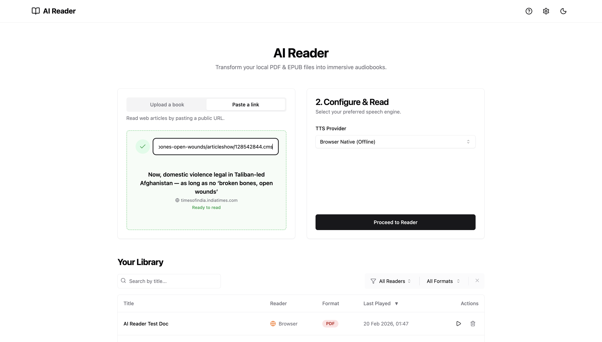
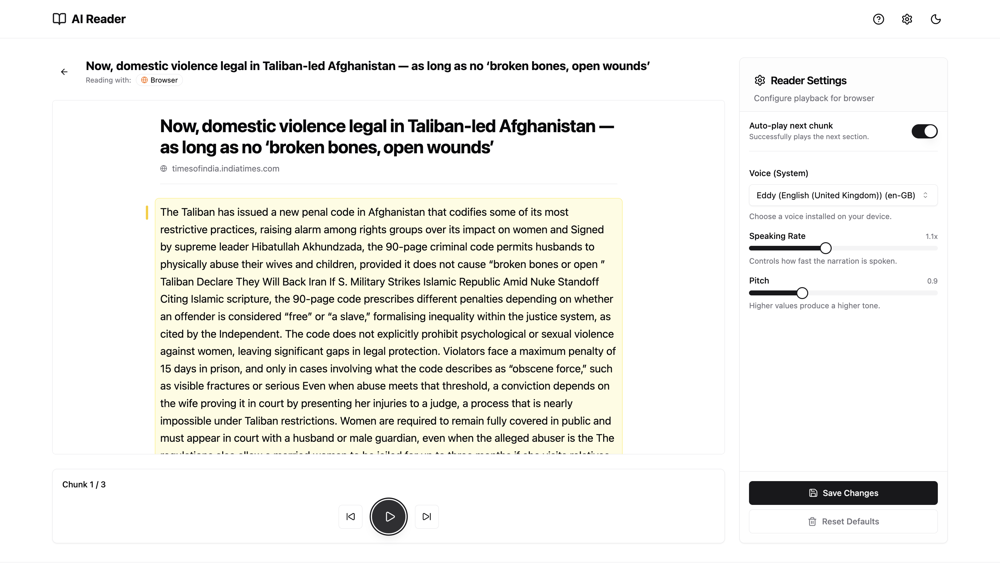
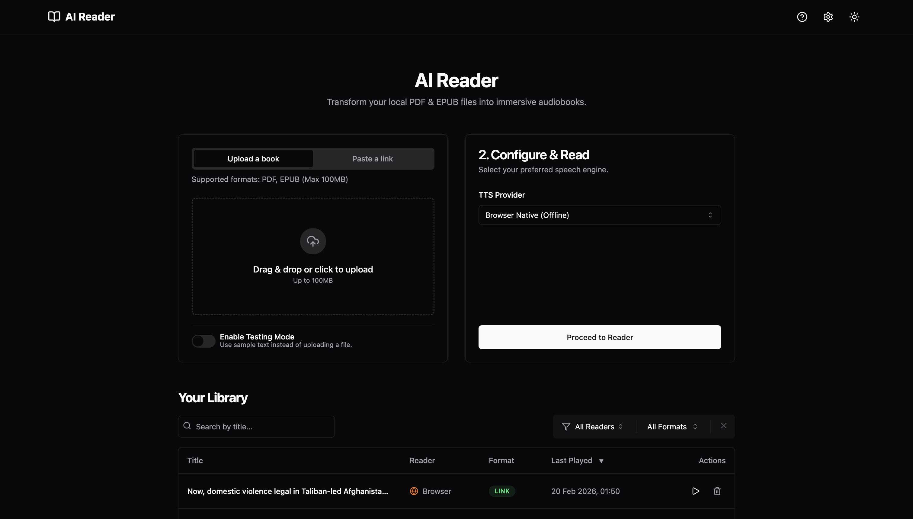
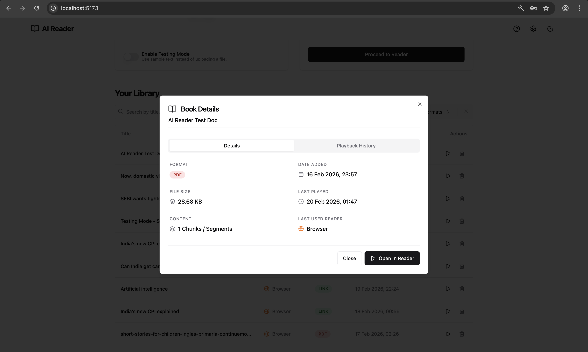
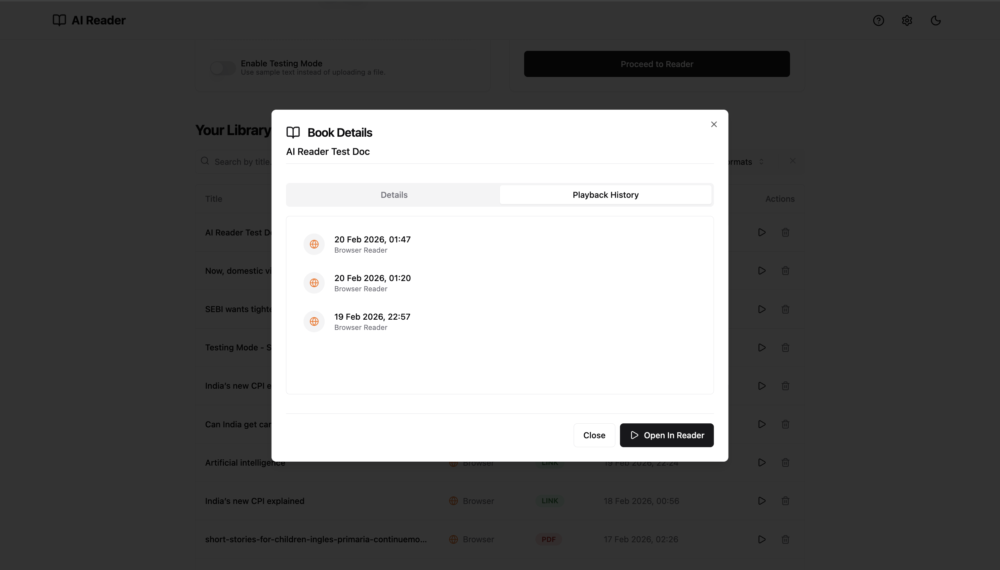
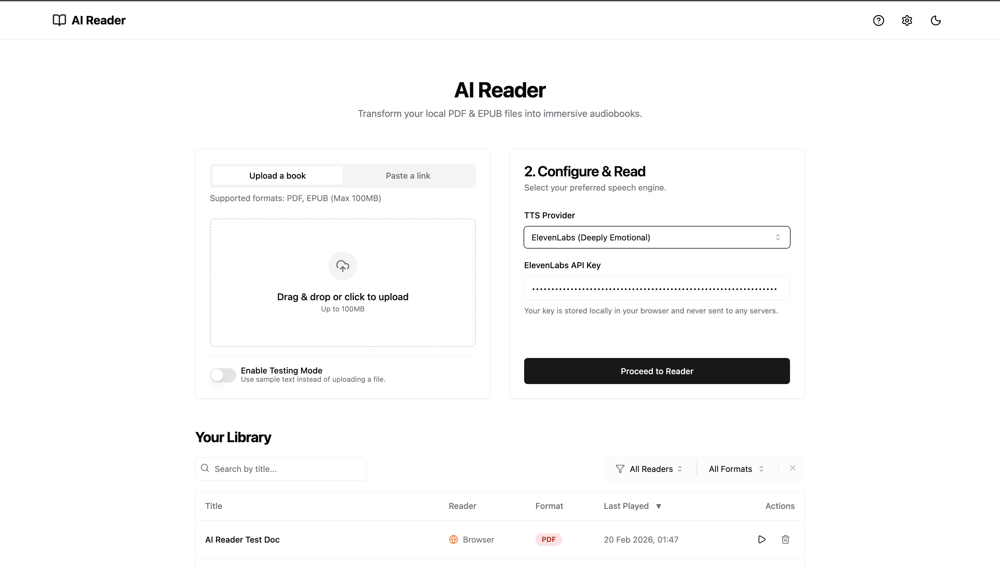
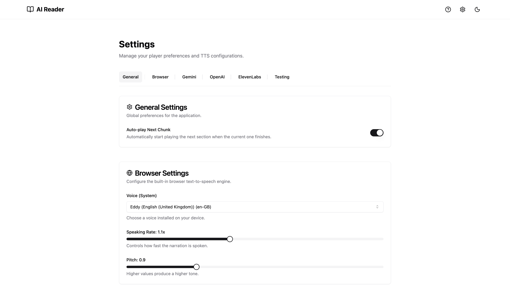
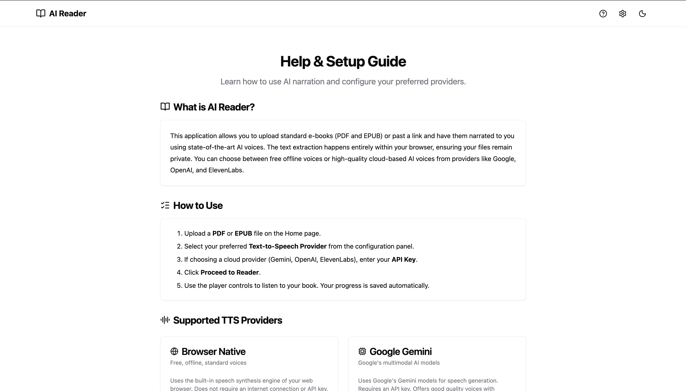

# AI Reader

A modern web application for converting books (PDF/EPUB) and web articles into immersive audiobooks using AI Text-to-Speech. Built with **Bun**, **React**, and **TypeScript** as a full-stack monorepo.

## 📸 Screenshots

<table>
  <tr>
    <td align="center"><b>Home — Upload a Book</b></td>
    <td align="center"><b>Paste a Link (Extracted)</b></td>
  </tr>
  <tr>
    <td></td>
    <td></td>
  </tr>
  <tr>
    <td align="center"><b>Reader — Article with TTS</b></td>
    <td align="center"><b>Dark Mode</b></td>
  </tr>
  <tr>
    <td></td>
    <td></td>
  </tr>
</table>

<details>
<summary>🖼️ View more screenshots</summary>
<br>

| Screen | Preview |
|---|---|
| Library |  |
| Book Details |  |
| Playback History |  |
| ElevenLabs TTS Config |  |
| Settings |  |
| Help & Setup Guide |  |

</details>

## ✨ Features

### 📚 Book Upload & Reading
- **PDF & EPUB Support** — Upload books up to 100MB with drag-and-drop or file picker
- **Web Article Extraction** — Paste any public URL to extract and read blog posts, news articles, and more
- **Smart Chunking** — Content is automatically split into manageable segments for reading
- **Testing Mode** — Try the reader with sample text without uploading anything

### 🔊 Text-to-Speech
- **Browser Native (Offline)** — Free, offline TTS using the Web Speech API
- **Google Gemini** — Cloud-based TTS via the Gemini API
- **OpenAI** — High-quality voices via the OpenAI TTS API
- **ElevenLabs** — Premium, natural-sounding voices via the ElevenLabs API
- **Playback Controls** — Play, pause, skip forward/backward, speed adjustment (0.5x–2.0x), and volume control

### 📖 Reader
- **Chunk-by-Chunk Navigation** — Browse through book segments with full keyboard navigation
- **Auto-Advance** — Automatically moves to the next chunk when playback finishes
- **Progress Tracking** — Visual progress bar and chunk counter
- **Client-Side Persistence** — Book chunks are cached in localStorage, surviving server restarts

### 📁 Library Management
- **Personal Library** — All uploaded books and extracted articles are saved in a searchable library
- **Metadata & Details** — View book details including format, date added, last played, reader used, and full source URL with one-click copy
- **Filtering & Sorting** — Filter by reader type and format; sort by last played
- **Pagination** — Paginated history table with customizable rows per page
- **Playback History** — Track reading sessions with timestamps

### 🎨 UI & UX
- **Dark Mode** — System-aware theme toggle (light/dark)
- **Responsive Design** — Works on desktop and mobile
- **Polished Interface** — Consistent card layouts, smooth animations, and interactive states
- **404 Page** — Custom not-found page with navigation back to home

---

## 🛠 Tech Stack

### Runtime
| Technology | Purpose |
|---|---|
| [Bun](https://bun.sh) | Node.js-compatible runtime & package manager |

### Frontend
| Technology | Purpose |
|---|---|
| [React 19](https://react.dev) | UI library |
| [Vite 7](https://vite.dev) | Build tool & dev server |
| [TypeScript](https://www.typescriptlang.org) | Type safety |
| [Tailwind CSS 3](https://tailwindcss.com) | Utility-first styling |
| [React Router](https://reactrouter.com) | Client-side routing |
| [Zustand](https://zustand.docs.pmnd.rs) | State management with localStorage persistence |
| [TanStack Query](https://tanstack.com/query) | Server state & data fetching |
| [React Hook Form](https://react-hook-form.com) + [Zod](https://zod.dev) | Form handling & validation |

### Backend (Node.js / Bun)
| Technology | Purpose |
|---|---|
| [Bun.serve()](https://bun.sh/docs/api/http) | Native HTTP server |
| [Express](https://expressjs.com) | Node.js web framework (middleware) |
| [Multer](https://github.com/expressjs/multer) | File upload handling |
| [Mozilla Readability](https://github.com/mozilla/readability) | Article content extraction |
| [JSDOM](https://github.com/jsdom/jsdom) | HTML parsing for server-side DOM |
| [pdf-parse](https://www.npmjs.com/package/pdf-parse) | PDF text extraction |
| [epub.js](https://github.com/futurepress/epub.js) | EPUB parsing |

### TTS Providers (Client-Side)
| Provider | Package |
|---|---|
| Browser Native | Web Speech API (built-in) |
| Google Gemini | [`@google/genai`](https://www.npmjs.com/package/@google/genai) |
| OpenAI | [`openai`](https://www.npmjs.com/package/openai) |
| ElevenLabs | [`elevenlabs`](https://www.npmjs.com/package/elevenlabs) |

---

## 🧩 UI Components

Built with [shadcn/ui](https://ui.shadcn.com) — a collection of accessible, customizable components built on Radix UI primitives:

| Component | Usage |
|---|---|
| `Alert Dialog` | Confirmations (e.g., delete book) |
| `Badge` | Format labels (PDF, EPUB, LINK) |
| `Button` | Actions throughout the app |
| `Card` | Content containers on Home, Reader |
| `Dialog` | Book details modal |
| `Input` | URL input, search, API key fields |
| `Label` | Form field labels |
| `Pagination` | Library table page navigation |
| `Progress` | Upload & reading progress bars |
| `Select` | TTS provider picker, rows-per-page |
| `Separator` | Visual dividers |
| `Slider` | Speed & volume controls |
| `Switch` | Testing mode toggle |
| `Table` | Library history table |
| `Tabs` | Upload/Link toggle, Details/History views |
| `Textarea` | Settings forms |
| `Tooltip` | Icon button descriptions |

### Additional UI Libraries
| Library | Purpose |
|---|---|
| [Lucide React](https://lucide.dev) | Icon library (70+ icons used) |
| [Sonner](https://sonner.emilkowal.dev) | Toast notifications |
| [React Dropzone](https://react-dropzone.js.org) | Drag-and-drop file upload |
| [tailwind-merge](https://github.com/dcastil/tailwind-merge) | Class name conflict resolution |
| [class-variance-authority](https://cva.style) | Component variant styling |
| [tailwindcss-animate](https://github.com/jamiebuilds/tailwindcss-animate) | CSS animations |

---

## 🚀 Getting Started

### Prerequisites

- **Bun** v1.1+ must be installed:
  ```bash
  curl -fsSL https://bun.sh/install | bash
  ```

### Installation

1. Clone the repository:
   ```bash
   git clone https://github.com/singhgautam7/AI-Book-Reader-Web.git
   cd AI-Book-Reader-Web
   ```

2. Install dependencies:
   ```bash
   bun install
   ```

### Running the App

Start both the frontend and backend with a single command:

```bash
bun run dev
```

| Service | URL |
|---|---|
| Frontend | http://localhost:5173 |
| Backend | http://localhost:3000 |

---

## 📂 Project Structure

```
ai-book-reader/
├── client/                 # React frontend (Vite)
│   ├── src/
│   │   ├── components/     # Reusable components (Layout, BookHistoryTable, ui/)
│   │   ├── lib/            # Utilities, constants, TTS service
│   │   ├── pages/          # Route pages (Home, Reader, Settings, Help, NotFound)
│   │   └── store/          # Zustand stores (bookStore)
│   └── index.html
├── server/                 # Bun HTTP server
│   ├── services/           # Extraction, chunking services
│   └── index.ts            # Server entry point with API routes
├── shared/                 # Shared TypeScript types
└── package.json            # Workspace root
```

---

## 🔒 Privacy

- **No cloud storage** — Files are processed locally and never uploaded to external servers
- **Client-side processing** — Text extraction happens in the browser
- **API keys are stored locally** — Provider keys are kept in your browser's localStorage
- **No analytics or tracking** — Zero telemetry

---

## 📄 License

Personal Use Only.
